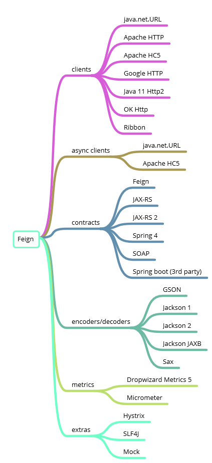

`Feign makes writing java http clients easier`，本文带你走进 feign 的世界，快速上手和入门

<!--more-->

<!-- slide -->

## 1 简介

<!-- slide vertical = true -->

### 1.1 是什么

- feign 是一款**声明式**的 web service 客户端，它让微服务之间的调用变得更简单
- feign 通过将**注解**处理为**模板请求**来工作，参数则应用于这些模板
- 其设计灵感来源于 Retrofit, JAXRS-2.0, WebSocket

```text
- java 原生 HttpURLConnection 偏底层，很难用
- Apache HttpClient 有很多优秀特性，使用最广，但用起来也比较麻烦
- OkHttp 有着更优秀的连接池
- spring RestTemplate 提供上层封装，提供非常简单好用的 API，不关心底层实现
- spring cloud 下，使用 feign 更简单优雅
```

<!-- slide -->

## 2 feign 的前世今生

<!-- slide vertical = true -->

这个章节很有必要，否则你看到底下几个类似的东西绝对要蒙圈：

- Netflix Feign
- Open Feign
- Spring Cloud Feign
- Spring Cloud OpenFeign

<!-- slide vertical = true -->

### 起源：Netflix Feign

<!-- slide vertical = true -->

- Feign 起初是 Netflix 发布的，作为 Netflix OSS 项目一部分

```text
- 最早的代码提交在 2012-03-18
- 第一个 pr 在 2013-06-27：[#1](https://github.com/OpenFeign/feign/pull/1)（我们看到的仓库已经是开源之后的了）
- 2016 7月发布其最后一个版本 8.18.0
```

<!-- slide vertical = true -->

### 开源：Open Feign

<!-- slide vertical = true -->

- 后来 Netflix 内部不再使用 Feign，停止更新并移交给开源社区，命名为 OpenFeign
- OpenFeign 受到开源社区的巨大支持并增加了很多新的特性和更新

```text
- 2016 7月发布首个版本 9.0.0
- 证书移除 Netflix 相关的内容 2018-08-08：[#755](https://github.com/OpenFeign/feign/pull/755)
```

<!-- slide vertical = true -->

### 后续：spring-cloud-openfeign

<!-- slide vertical = true -->

- Spring Cloud OpenFeign 将 feign 整合进了 Spring Cloud 生态，集成了注册中心、Ribbon、Hystrix 等组件
- 增加了对 Spring MVC 相关注解的支持
- 开源社区十分活跃，发展良好
- spring-cloud-feign 只是其前身，不用管它

```text
- 最早的代码提交在 2014-07-14 [commit](https://github.com/spring-cloud/spring-cloud-openfeign/commit/9b506638f717ae0251fe51e068276b0640956492)
- 第一个 pr 在 2018-03-10 [#6](https://github.com/spring-cloud/spring-cloud-openfeign/pull/6)
```

<!-- slide vertical = true -->

|            | groupId | artifactId | first release | last relsese | repository | 适用环境 |
| ---------- | ------- | ---------- | ------------- | ------------ | ---------- | ------- |
| Netflix Feign | com.netflix.feign | feign-core | 2013.6 `1.0.0` | 2016.7 `8.18.0` | - | - |
| Open Feign | io.github.openfeign | feign-core | 2016.7 `9.0.0` | 至今 | Netflix Feign 的延续</br><https://github.com/OpenFeign> | - |
| Spring Cloud Feign | org.springframework.cloud | spring-cloud-starter-feign | 2015.3 `1.0.0` | 2019.5.23 `1.4.7.RELEASE` | - | Spring Cloud 1.x |
| Spring Cloud OpenFeign | org.springframework.cloud | spring-cloud-starter-openfeign | 2017.11 `1.4.0.RELEASE` | 至今 | Spring Cloud Feign 的延续</br><https://github.com/spring-cloud/spring-cloud-openfeign> | Spring Cloud 2.x |

<!-- slide -->

## 3 Spring Cloud OpenFeign 快速上手

<!-- slide vertical = true -->

### 3.1 client 要做的事儿

<!-- slide vertical = true -->

#### 3.1.1 依赖

- 引入所有依赖（一键套娃）：`compile('org.springframework.cloud:spring-cloud-starter-openfeign:2.1.1.RELEASE')`

<!-- slide vertical = true -->

#### 3.1.2 启用 feign client

- 主程序 Application.java 添加注解声明 `@EnableFeignClients`

<!-- slide vertical = true -->

#### 3.1.3 定义 feign client interface，用于 API 调用

- 例如，当前 client 需要依赖 international-flight-service 服务的某个接口，则进行如下定义

```java
@FeignClient(value = "international-flight-service")
@RequestMapping(SearchRouter.SEARCH_ROOT)
public interface IntFlightSearchFlightsClient {

  @PostMapping(SearchRouter.SHOPPING)
  ResponseContainer<IntFlightShoppingResponseDto> shopping(@RequestBody IntFlightShoppingRequestDto request);

}
```

<!-- slide vertical = true -->

### 3.2 server 要做的事儿

无！

<!-- slide vertical = true -->

### 3.3 优化

<!-- slide vertical = true -->

至此，最简单的 feign client 已经搭起来了，已经可以简单优雅的进行服务间通信了。

<!-- slide vertical = true -->

但存在 bad smell（和 feign 本身无关）：如果多个 client 依赖同一个 server，每个 client 都要重复定义 feign client interface，麻烦，且严重**违反 DRY 原则**，优化思路：

<!-- slide vertical = true -->

- server 抽出**子项目**，用于定义 feign api，例如 international-flight-service-api 子项目
  - 子项目声明对 feign 的依赖
  - 子项目定义 feign client interface，和父项目 controller 一一对应，进行约束：
    - 引用相同的 api url 常量
    - 引用相同的 dto
    - 必要的话，让 controller extends feign client interface，实现方法上的约束
- client 引入 server 子项目的 jar 包即可

<!-- slide vertical = true -->

### 3.4 原理简述

<!-- slide vertical = true -->

- client 服务启动时，检测到 @EnableFeignClients 注解
- 包扫描过程会扫描所有 @FeignClient 注解的类，对其创建 RPC 请求的本地 JDK proxy 代理实例
- Spring IOC 容器管理这些代理实例
- 被调用时，proxy 完成真正的远程调用

> 对代理实现感兴趣的看 FeignInvocationHandler 和 HystrixInvocationHandler

<!-- https://www.cnblogs.com/crazymakercircle/p/11965726.html 这篇博客讲原理还行 -->

<!-- slide -->

## 4 带你避坑

<!-- slide vertical = true -->

### 4.1 关于超时

- 现象：从 0 开始搭建 feign client，一定会遇到请求超时，但可能是偶发的
- 解决方案：配置修改示例：（尤其 ReadTimeout，按照项目实际情况配置）

```yml
# feign client ribbon 配置
ribbon:
  # 默认1s -> 30s
  ReadTimeout: 30000
  # 默认1s -> 5s
  ConnectTimeout: 5000
```

<!-- slide vertical = true -->

### 4.2 集成测试失败

- 现象：运行集成测试，报错 `Load balancer does not have available server for client: international-flight-service`
- 原因：集成测试需要 mock 远程调用，所以需要关闭负载均衡
- 解决方案：集成测试需要使用固定地址，配置文件：

```yml
international-flight-service:
  # 固定地址，使 feign 的 LB 失效
  ribbon:
    listOfServers: localhost:${wiremock.port}
```

<!-- slide vertical = true -->

### 4.3 FeignClient bean 重名问题

- 现象：启动服务，报错 `The bean 'international-flight-service.FeignClientSpecification', defined in null, could not be registered. A bean with that name has already been defined in null and overriding is disabled`
- 原因：一个服务不允许多个 @FeignClient 的 value 的相同，因为 value 会作为 bean name，这是默认行为
- 解决方式：手动声明 contextId 作为 bean name

```java
@FeignClient(
  value = "international-flight-service",
  contextId = "intFlightSearchFlightsClient"
)
@RequestMapping({"/international-flight/v1/search"})
public interface IntFlightSearchFlightsClient {
}
```

<!-- slide vertical = true -->

### 4.4 API 声明的返回值和实际返回值不一致

- 声明返回值：feign client interface 本应该和 controller 的返回值一致（甚至开始的时候我还打算让 controller implement feignClientInterface）。比如期望某 API 返回 String 类型
- 实际返回值：由于 filter 在返回值中做了些手脚，将结果包装了一层对象，并加上了错误码和错误信息等字段，实际返回值就成了 ResponseContainer\<String>
- 解决方案：
  - 方案一：有些同学本就反对在 filter 中做这种包装，如果移除这层逻辑，能解决根本问题，不过改动很大
  - 方案二：声明 feign client interface 的时候，让它和对应的 controller 返回值不同，并接受这种不一致的现状
    - 使用 ResponseContainer 包装返回结果
    - 使用 EmptyResponseContainer 替代 void 类型

<!-- slide vertical = true -->

### 4.5 @RequestParam 注解和 springmvc 中的行为有稍许差异

- 现象：启动服务，报错 `RequestParam.value() was empty on parameter 0`
- 原因：feign 处理 @RequestParam 注解的行为时，没有完全和 springmvc 保持一致，springmvc @RequestParam value 允许不填，默认和字段名一样
- 解决方式：填上 value 就好

```java
ResponseContainer<IntFlightCommissionConfigDetailDto> getCommissionConfigDetail(@RequestParam(value = "id") String id);
```

## 5 what's more

- 本文就写到这里
- 你以为结束了？其实才刚刚开始：


2 

3 

